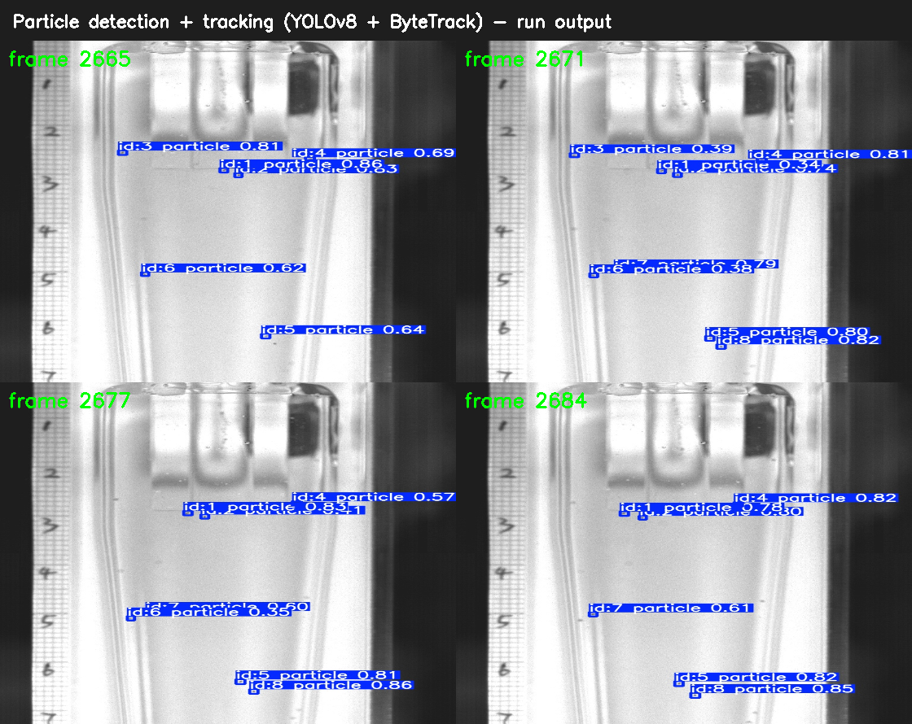

# Particle Detection, Tracking and Kinematic Measurement in a Hydrocyclone Swirling Flow

Reference implementation accompanying the manuscript on **machine-learning-assisted automated
measurement of three-dimensional particle rotation and revolution in hydrocyclone swirling flows**.

The pipeline implements an end-to-end sensing strategy:

```
high-speed image sequences
        │
        ▼
[1] YOLOv8 detector            (per-view particle detection)
        │
        ▼
[2] ByteTrack                  (multi-object tracking → trajectory IDs)
        │
        ▼
[3] EfficientNet-B1 classifier (per-particle motion-state recognition)
        │
        ▼
[4] Kinematic model            (revolution / rotation velocity, height, calibration)
        │
        ▼
    measurement figures / tables
```

---

## 1. Repository structure

```
particle_reproduce/
├── app.py                  # Gradio web UI + top-level orchestration of the whole pipeline
├── run_pipeline.py         # CLI: run the full pipeline on a (Y, X) dataset, no Gradio
├── run.py                  # Minimal entry: run the detection→JSON conversion only
├── config.json             # Pipeline configuration (directories, camera fps)
├── requirements.txt        # Pinned runtime dependencies
│
├── tracking/
│   ├── track.py            # [1]+[2] YOLO detection + ByteTrack tracking (BoxMOT)
│   ├── detectors/          # YOLO-family detector wrappers (yolov8/yolov9/yolonas/yolox)
│   ├── utils.py
│   └── weights/            # BoxMOT ReID weights (osnet, only needed for ReID trackers)
│
├── new/
│   ├── process_utils.py    # shared helpers (folder/video handling, distance drawing)
│   ├── contrast.py         # image contrast enhancement (pre-processing)
│   ├── batch.py            # batch image enhancement (Y view)
│   ├── x_batch.py          # batch TIFF→JPEG + enhancement (X view)
│   ├── y_make_images_2_video.py  # frames → video for the Y view
│   ├── x_make_images_2_video.py  # frames → video for the X view
│   ├── convert.py          # [3] EfficientNet-B1 classification + per-ID JSON records
│   ├── 1_extract.py        # [4a] trajectory selection, edge/height, revolution/rotation frames
│   ├── 2_images_x.py       # [4b] X-view matching and edge-distance (margin) computation
│   ├── 3_end.py            # [4c] final revolution / rotation velocities (rad/s)
│   ├── detect_convert.py   # X-view detection → JSON records
│   ├── 4_delete_videos.py  # cleanup utility
│   ├── plot_particle.py            # Figure 8-style motion plots
│   ├── plot_particle_both.py       # combined rotation+revolution plots (Excel export)
│   ├── plot_rotation_distribution.py
│   ├── plot_particle_excel.py
│   └── compare_true_predict.py     # Figure 7: MANUAL vs THIS STUDY, per-Qi accuracy (a–f)
│
├── boxmot/                 # vendored BoxMOT library (v11.0.6, AGPL-3.0)
├── weights/                # trained model weights (see §5)
└── sample_data/            # a small 20-frame sample of the Y-view tracking set
```

---

## 2. Environment

Python 3.10–3.12 (verified on 3.12), a CUDA-capable GPU recommended.

```bash
# (recommended) isolated environment
python -m venv .venv && . .venv/Scripts/activate    # Windows
pip install -r requirements.txt

# if you need a specific CUDA build of PyTorch:
pip install torch==2.2.2 torchvision==0.17.2 --index-url https://download.pytorch.org/whl/cu121
```

Everything is run **from the repository root** (relative paths inside the code assume this).

---

## 3. Quick start

### 3.1 One-command full pipeline (CLI, recommended)

`run_pipeline.py` runs the whole workflow for a paired (Y, X) image-sequence dataset
without the Gradio UI — enhancement → video → detection/tracking → classification →
kinematics → plots:

```bash
python run_pipeline.py --y path/to/Y_images --x path/to/X_images

# example with the bundled sample (Y only; Y view stage runs, X stage needs X data)
python run_pipeline.py --y sample_data/275_particle/img1 --x path/to/X_images --name 275-001

# useful options
#   --fps 8000          Y-camera frame rate       --x-fps-ratio 0.5
#   --no-classify       skip EfficientNet-B1      --max-files 500
#   --skip-plots        skip the plotting stage
```

Outputs:

| Path | Content |
|---|---|
| `runs/track/<name>/labels/` | per-frame detections + track IDs (Y view) |
| `runs_x_me/detect/<name>/labels/` | per-frame detections (X view) |
| `runs/track/<name>/initial_result/` | per-ID JSON, `all_stats.json`, `calculation_results.json` |
| `plots/` | motion plots |

### 3.2 Web interface (full pipeline)

```bash
python app.py
# open http://127.0.0.1:7860
```

`app.py` orchestrates, for each (Y, X) directory pair:

1. image enhancement (`new/contrast.py` via `new/batch.py`, `new/x_batch.py`)
2. frames → video (`new/y_make_images_2_video.py`, `new/x_make_images_2_video.py`)
3. detection + tracking (`tracking/track.py`, `conf=0.01`, `iou=0.01`, ByteTrack)
4. classification + JSON (`new/convert.py`)
5. kinematic extraction (`new/1_extract.py` → `new/2_images_x.py` → `new/3_end.py`)
6. plots (`new/plot_particle.py`, `new/plot_particle_both.py`)

### 3.3 Command line

```bash
# detection + tracking on an image sequence (Y view)
python tracking/track.py \
  --yolo-model weights/yolov8-particle-best.pt \
  --source sample_data/275_particle/img1 \
  --save --save-txt --tracking-method bytetrack --conf 0.02 --iou 0.01 \
  --project runs --name smoke

# detection + tracking on a video (X view)
python tracking/track.py \
  --yolo-model weights/yolov8_best.pt \
  --source path/to/x_video.mp4 \
  --save --save-txt --conf 0.01 --iou 0.01 \
  --project runs_x_me --name exp
```

`--save-txt` writes one label file per frame with 6 columns:
`class  cx  cy  w  h  track_id` (normalised by image width/height).

### 3.4 Post-processing (kinematics)

The post-processing steps are normally driven by `app.py`. They can also be invoked directly:

```bash
cd new
python 1_extract.py  ../runs            # trajectory selection + revolution/rotation frames
python 2_images_x.py ../runs ../runs_x_me 0.5
python 3_end.py      ../runs 8000       # final revolution/rotation velocities (rad/s)
```

Final results are written to
`runs/<run>/initial_result/calculation_results.json`
and `runs/<run>/initial_result/all_stats.json`.

---

## 4. Reproducibility details

### 4.1 Detector (YOLOv8)

| Item | Value |
|---|---|
| Framework | Ultralytics YOLOv8 (verified with `ultralytics==8.3.18`) |
| Training data | Y-view: Y-camera annotated frames; X-view: merged X+Y frames |
| Input size | 640 × 640 |
| Epochs | 100 |
| Batch size | 16 |
| Seed | 42 |
| Augmentation | Ultralytics defaults (mosaic, HSV, translate 0.1, scale 0.5, fliplr 0.5) |
| GAN augmentation | SAGAN (see the Kaggle kernel in §6) |
| Deployed weights | `weights/yolov8-particle-best.pt` (Y view), `weights/yolov8_best.pt` (X view) |

### 4.2 Tracker (ByteTrack)

| Item | Value |
|---|---|
| Tracker | ByteTrack (BoxMOT), motion-only (no ReID) |
| Detection conf / IoU thresholds | `conf = 0.01`, `iou = 0.01` (permissive, to keep faint particles) |
| Config | `boxmot/configs/trackers/bytetrack.yaml` |

### 4.3 Classifier (EfficientNet-B1)

| Item | Value |
|---|---|
| Backbone | `torchvision` EfficientNet-B1 (ImageNet-pretrained) |
| Head | `Linear(1280 → 2)` (two motion states) |
| Input | 224 × 224, ImageNet normalisation (`mean=[.485,.456,.406]`, `std=[.229,.224,.225]`) |
| Deployed weights | `weights/best_model_new_eff1.pth` |

### 4.4 Kinematic model & calibration

Implemented in `new/1_extract.py`, `new/2_images_x.py`, `new/3_end.py`.

| Item | Value |
|---|---|
| Y-camera spatial scale | **147 px/cm** |
| X-camera spatial scale | **101 px/cm** (ratio `147/101` used for margin conversion) |
| Y-camera frame rate | **8000 fps** (`y_camera_fps`, editable in the UI / `config.json`) |
| X / Y frame-rate ratio | 0.5 (`x_camera_fps_ratio`) |
| Image size (Y view) | 768 × 1024 px |
| Hydrocyclone corner (height breakpoint) | row `y = 437` (upper/lower section boundary) |
| Central axis | column `x = 363` |
| Height formula | `height = y_center / 147` (cm) |
| Revolution velocity | `ω_orb = fps · (α₁ + α₂) / (N_rev − 1)`, `α = asin(d / radius)` |
| Rotation velocity | `ω_rot = (changes · π · fps) / (2 · (N_rot − 1))` |
| Trajectory filtering | edge-distance ratio ≥ 0.6; same-side rejection; height ≤ 10.5 cm for rotation; rotation-time fraction ≥ 0.4 |

Camera synchronization: the two orthogonal high-speed cameras are hardware-triggered and shoot
simultaneously; a particle therefore appears at the same height (z) in both views at the same time,
which is what allows the X-view edge distance to be matched to the Y-view trajectory.

---

## 5. Model weights

The trained weights are stored in this repository via **Git LFS** (run `git lfs install` before
cloning; if you already cloned, run `git lfs pull`):

| File | Role |
|---|---|
| `weights/yolov8-particle-best.pt` | Y-view particle detector |
| `weights/yolov8_best.pt` | X-view particle detector (mixed-view training) |
| `weights/best_model_new_eff1.pth` | EfficientNet-B1 motion-state classifier |
| `tracking/weights/osnet_x0_25_msmt17.pt` | BoxMOT ReID backbone (included; unused with ByteTrack) |

---

## 6. Data & training code availability

* **Sample data**: `sample_data/275_particle/img1/` contains 20 consecutive frames from the
  Y-view tracking-evaluation sequence (full-resolution 768 × 1024).
* **Full datasets** (Kaggle):
  * Y-view particle detection dataset — https://www.kaggle.com/datasets/liuweiq/yolo-great-particle-data
  * X-view particle detection dataset — https://www.kaggle.com/datasets/liuweiq/yolo-x-camera-data
  * Motion-state classification dataset — https://www.kaggle.com/datasets/liuweiq/efficientnet-data
* **Training code** (Kaggle kernels):
  * YOLOv8 detector (Y/X) — https://www.kaggle.com/code/liuweiq/yolov8-v9-v10
  * EfficientNet-B1 classifier — https://www.kaggle.com/code/liuweiqing2/efficient-net-nice
  * SAGAN data augmentation — https://www.kaggle.com/code/liuweiqing2/sagan-particle
* **Revised (temporal-split) detector trainings** (chronological 8:1:1 split with a 10-frame
  boundary buffer; `ultralytics` 8.4.149):
  * YOLOv8s — Y-view detector — https://www.kaggle.com/code/liuweiqing2/yolov8s-faithful-temporal
  * YOLOv8s — X-view detector (mixed-view training) — https://www.kaggle.com/code/liuweiqing2/yolov8s-faithful-yx-temporal
  * Original random-split reproduction (for comparison with the original submission) —
    https://www.kaggle.com/code/liuweiqing2/yolov8s-faithful
* **Revised (temporal-split) detector-framework comparison** (identical protocol for all
  frameworks, same test set):
  * YOLOv5s — https://www.kaggle.com/code/liuweiqing2/yolov5su-faithful-temporal
  * YOLOv9s — https://www.kaggle.com/code/liuweiqing2/yolov9s-faithful-temporal
  * RT-DETR-L — https://www.kaggle.com/code/liuweiqing2/rtdetr-l-faithful-temporal
  * YOLOv5s (original `ultralytics/yolov5` repository version, legacy record) —
    https://www.kaggle.com/code/liuweiqing2/yolov5s-faithful-temporal

---

## 7. Verification performed

The extracted repository was run locally end-to-end on the bundled sample data:

| Step | Command | Result |
|---|---|---|
| Full pipeline (CLI) | `run_pipeline.py --y <Y> --x <X>` | completes all 5 stages, `PIPELINE COMPLETE`, exit 0 |
| Web UI + API | `app.py` then Gradio `process_with_subcommand` | folder-mode run completes, returns video + JSON + log |
| Detection + tracking | `tracking/track.py` on `sample_data/275_particle/img1` | 6–8 particles / frame, 20 label files written |
| Classification + JSON | `new.convert.main_convert(...)` | per-ID `initial_data.json` with motion-state `Category` |
| Kinematic extraction | `new/1_extract.py ../runs` | `all_stats.json` produced |

Example output of the detection + tracking stage on four sample frames (bounding boxes are the
YOLOv8 detections retained by ByteTrack):



> Note: with the tiny 20-frame sample (and/or too few valid trajectories) the plot stage
> has nothing to draw and is skipped with a warning; on a full dataset it produces the
> motion figures in `plots/`.

---

## 8. License

The vendored `boxmot/` library is licensed **AGPL-3.0** (© Mikel Broström). See `boxmot/` and the
upstream BoxMOT project for the full license text.
